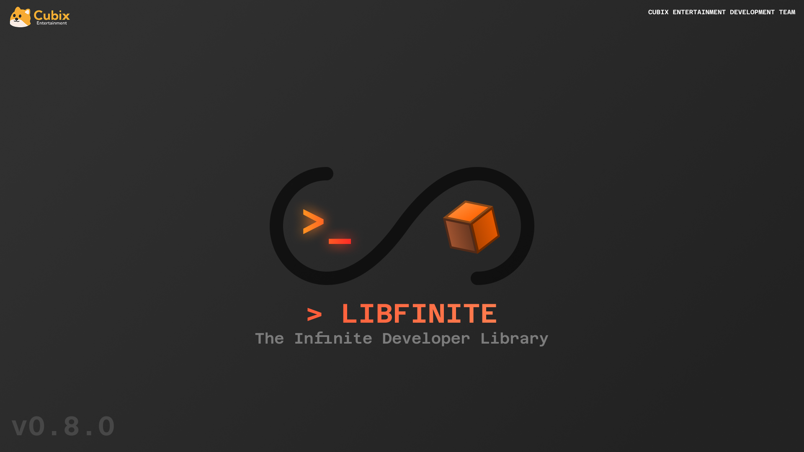

# libfinite

The Infinite C Library

## Are We libfinite Yet?

> [!NOTE]
> This list is subject to change. Check back regularly to see if anything new has been added!

- [x] Window Rendering (with Cairo)
- [x] Window Rendering Example
- [x] Keyboard Input
- [x] Textbox Input
- [x] Controller Input
- [x] Vulkan Rendering
- [x] Vulkan Examples
- [x] Vulkan Rendering (with basic 3D rendering)
- [x] Vulkan Rendering (with texture loading)
- [x] Vulkan Rendering (with mesh loading)
- [ ] Vulkan Memory Allocation Integration (being worked on)
- [x] Audio
- [x] Audio Example
- [ ] Audio Seeking (rewind,pausing)
- [ ] Audio Effects
- [x] Logging/Core Functions
- [x] Auth API
- [x] User API
- [x] JSON Utilites
- [ ] File System Utilities
- [ ] Avatar
- [ ] GameShare
- [ ] Notifications
- [ ] Papernet Service Integration (being worked on)  

## Project Goals

The objective of libfinite is to create an abstractable, simple and lightweight development library for Infinite game developers that handles the complexities of interacting with the console behind simple, easy to understand APIs and functions while still giving developers the freedom-of-choice to implement their own versions of these functions.

## Dependencies

You'll need the following packages in order to build libfinite.

> [!IMPORTANT]
> libfinite ships with an IPC client called mailroom that must be built **AFTER** building libfinite.
> 
> Additionally, libfinite is intended to be used in a Linux environment. We will not help resolve issues that may arise from attempting to run this on WSL or any other non-Linux environments.

- Meson
- Ninja
- wayland
- wayland-protocols
- cairo
- xkbcommon (x related dependencies not needed)
- vulkan
- [cglm](https://github.com/recp/cglm/releases/latest)
- [libsndfile](https://github.com/libsndfile/libsndfile)
- [libasound (ALSA development wrappers)](https://github.com/pop-os/libasound2)

Additionally mailroom has a few additional dependencies

- libcurl
- libevdev
- libudev
- [libwebsockets](https://libwebsockets.org/)

## License

This project is intended to be open source to members of the Infinite Developer Environment. As a developer for Infinite Hardware you are free to edit, change or otherwise modify this project with the intention of contributing to the improve of the Infinte Developer tools. You may **not** however redistribute or resell any version of this project without the express written consent of Cubix Entertainment LLC.

###### *Copyright © 2026 Cubix Entertainment LLC / All rights reserved. Cubi, the libfinite Logo and the Cubix Logo are trademarks of Cubix Entertainment LLC.*
